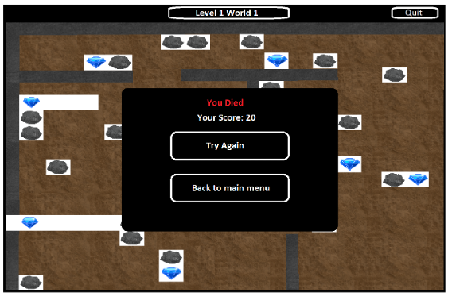

# Game Design - Diamond Cave

_Group 1: GameChangers – DHI2V.So_ - Project Server and Client

---

This game design document describes the details for a massive multiplayer online, massive spectators, chatting, monitored, moderated, ranking (MMOMSCMMR) game. Diamond Cave is a 2D web browser co-op game based on the old Emerald Mine game but taken to a whole new experience with extra features and multiplayer functionality.

## 1. Story

Attracted by the fame and glory, two amateur archeologists, Bob and Eve, set foot into the infamous "Diamond Cave" in hopes of collecting valuable gems. But, unbeknownst to them, blood-thirsty enemies, booby traps, and mind-boggling puzzles lurk behind every corner. Will they make it out alive, or will they succumb to the weakness of their hearts and become yet another victim of this dangerous cave?

## 2. Gameplay

The game is playable exclusively in the duo co-op mode of two people. A run can only begin once both players have connected and formed a team.

### 2.1. Worlds

The game has three worlds, each with a different theme and difficulty. A world contains a set of levels that a duo must complete to continue to the next world. The difficulty of the worlds increase incrementally, where world 1 is the easiest, and world 3 is the most difficult.

### 2.2. Maps

Maps are categorized based on their world and therefore adopt the same theme and difficulty level. They are further divided into different objectives that the players have to achieve to progress onto the following map. The objectives include collecting all the gems present on the map, solving puzzles, or staying alive while avoiding traps.

### 2.3. Level Progression

The two players progress through the game by completing the objective of the current map. Every time a new world is reached, the team gets a checkpoint, allowing to restart from the said world in the unfortunate case of death.
While the worlds are fixed and predetermined, a set number of maps are randomly selected from a larger pool for each run to make the game more interesting and replayable.

### 2.4. Buffs

After each finished map, the team is offered a choice between two bonuses that would give them an advantage for the levels to come. Buff effects are applied immediately. Some of the buffs include:

<table>
    <tr>
        <th>Icon</th>
        <th>Name</th>
        <th>Effect</th>
        <th>Rarity</th>
    </tr>
    <tr>
        <td>TBD</td>
        <td><b>Life Rune</b></td>
        <td>Team gains an extra life</td>
        <td>Common</td>
    </tr>
    <tr>
        <td>TBD</td>
        <td><b>Boots of Speed</b></td>
        <td>Grants 4% extra movement speed</td>
        <td>Common</td>
    </tr>
    <tr>
        <td>TBD</td>
        <td><b>Bloodstone</b></td>
        <td>Transforms itself in 3 Diamonds</td>
        <td>Common</td>
    </tr>
    <tr>
        <td>TBD</td>
        <td><b>Continuum Orb<b></td>
        <td>Reduces total run time with 25 seconds</td>
        <td>Rare</td>
    </tr>
</table>

___Note:_ The buffs are subject to change. More buffs may be added, or existing buffs may be removed to maintain the game's balance.__

### 2.5. Goals

The game's ultimate objective is to escape a series of caves (maps) by completing the objective of each map while having fun on the way.

### 2.6. Losing

Each team has a shared life pool. Once the team loses its last life, the game ends, and the team's score is recorded.

### 2.7. Ranking System

Teams are ranked based on the run time, the diamonds collected, and the remaining lives. Each world has its rank list, and there is a global ranking for teams that have completed the whole run. The formula for determining the final score is:
> TBD

## 3. Objects

<table>
    <tr>
        <th>Name</th>
        <th>Image</th>
        <th>Behavior</th>
    </tr>
    <tr>
        <td>Player 1</td>
        <td>TBD</td>
        <td rowspan="2">
            <ul>
                <li>Can be controlled by the first player in 4 directions</li>
                <li>Can be controlled by the first player in 4 directions</li>
                <li>Can dig Dirt and collect Diamonds</li>
                <li>Can go into Map Exit to complete a level</li>
            </ul>
        </td>
    </tr>
    <tr>
        <td>Player 2</td>
        <td>TBD</td>
    </tr>
    <tr>
        <td>Map Wall</td>
        <td>TBD</td>
        <td>
            <ul>
                <li>Defines the boundaries of the map</li>
                <li>Can not be destroyed</li>
            </ul>
        </td>
    </tr>
    <tr>
        <td>Dirt</td>
        <td>TBD</td>
        <td>
            <li>Can be cleared by a <i>Player</i> by mining it</li>
        </td>
    </tr>
    <tr>
        <td>Rock</td>
        <td>TBD</td>
        <td>
            <li>Cannot be cleared by mining</li>
        </td>
    </tr>
    <tr>
        <td>Diamond</td>
        <td>TBD</td>
        <td>
            <ul>
                <li>Can be collected by a <i>Player</i> by moving into it</li>
                <li>Can be spawned by a <i>Game Master</i></li>
            </ul>
        </td>
    </tr>
    <tr>
        <td>Locked Map Exit</td>
        <td>TBD</td>
        <td>
            <ul>
                <li>Can be unlocked when a <i>Player</i> collects enough diamonds to complete a level</li>
                <li>Cannot be destroyed</li>
            </ul>
        </td>
    </tr>
    <tr>
        <td>Unlocked Map Exit</td>
        <td>TBD</td>
        <td>
            <ul>
                <li>Allows a <i>Player</i> to proceed to next level by moving into it</li>
                <li>Cannot be destroyed</li>
            </ul>
        </td>
    </tr>
</table>

## 4. Wireframes

To provide a better idea of what our game will encapsulate, several mockup wireframes are included below detailing some main functionalities and how specific components will look/behave.

### 4.1. Menus

### 4.1.1. Main menu

This wireframe shows the main menu. Here, you have the option to go to "Play Game," "Leaderboard," and "Exit." "Play game" will lead to further instructions. The leaderboard button will lead you to a window that shows the score of different teams. "Exit" will close the game.

### 4.1.2. Leaderboard

This wireframe shows the leaderboard. You will see your (and others) name and what score they achieved.

### 4.1.3. Play Game menu

This wireframe Shows the menu after you press "Play Game." You have the choice to either create a Team or join a Team. You also have the option to go back to the main menu.

### 4.1.4. Create Team menu

This wireframe shows what you see if you press "Create Team." On the top, you see the randomly generated Teamcode, which is needed for others to join. Under that, you can see how many players are in your team currently. And you have the option to press start game which will lead to the actual game. And there is an option to go back to the previous window.

### 4.1.5. Join Team menu

This wireframe shows the menu after you press "Join a Team." You can enter the team code from the team you want to join on the top. Then if you press Join a team, you will get led to the window of Create Team.

## 4.2. Gameplay

### 4.2.1. Map

After creating your team, you will go to the first level of the first world. This simple wireframe shows a few assets of the game to give you an idea. A level has brown dirt blocks that the player can mine. The grey stones are one of the Objects that the player cannot mine. The diamonds need to be collected by the player, but the rocks can fall if you tunnel under them. You can see which level and world you're in on the top of the screen. And on the top right, you see the quit button, which will bring you back to the main menu.

### 4.2.2. In-game Quit menu

If you press the "Quit" button, you get to see your score, and it gives you two options. You can either play again or go back to the main menu.

### 4.2.3. Game over

If you die, you get to see a quite similar screen to the quit menu screen, but there is a text saying that you died this time.

### Game worlds 

#### World 1 Nature theme

#### World 2 Ice theme

#### World 3 Fire theme

#### World 4 Dungeon theme

