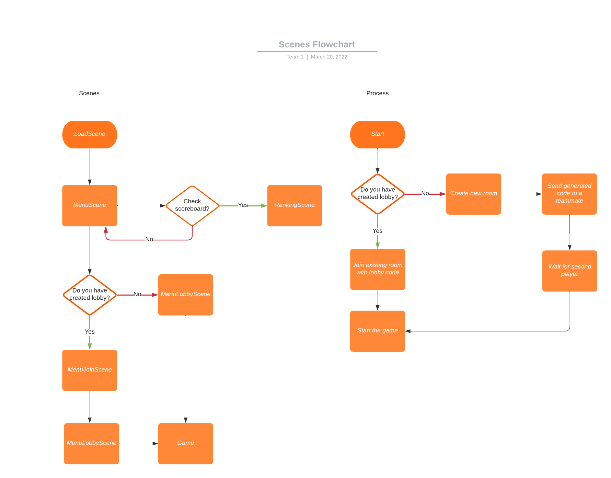

# _Technical design_

_Group 1 : GameChangers – DHI2V.So_ - Project Server and Client

---

## 1 Game Engines Researched and Discussed

For the scope of this project, all the members of the team decided to focus on the JavaScript game engines since every member had experienced JavaScript before and it would be the best option to have all people on the same page.

During the class, we talked about 3 different game engines: Phaser, KiwiJs and PixiJS. Each section below will give a brief description of how those game engines are working.

### 1.1 Phaser

According to the README.md file on Phaser's [GitHub repository](https://github.com/photonstorm/phaser/blob/master/README.md): "Phaser is a fast, free, and fun open source HTML5 game framework that offers WebGL and Canvas rendering across desktop and mobile web browsers. Games can be compiled to iOS, Android and native apps by using 3rd party tools. You can use JavaScript or TypeScript for development". For more information, please refer to the [website](https://phaser.io/) or [API Documentation.](https://newdocs.phaser.io/docs/3.55.2)

### 1.2 KiwiJS

According to the README.md file on KiwiJS's [GitHub repository](https://github.com/gamelab/kiwi.js#readme): "Kiwi.js is the world's easiest to use Open Source HTML5 game framework for making both mobile and desktop HTML5 browser games.". For publishing games and App creation, KiwiJS uses [CocoonJS](https://ludei.com/) framework. For further information please refer to the website or API Documentation.

### 1.3 PixiJS

According to the README.md file on PixiJS's [GitHub repository](https://github.com/pixijs/pixijs#readme): "PixiJS is a rendering library that will allow you to create rich, interactive graphics, cross platform applications, and games without having to dive into the WebGL API or deal with browser and device compatibility.". For more details about the library, refer to the [website](https://pixijs.com/) or the [API Documentation](https://pixijs.download/release/docs/index.html)

After conducting research on those options, we come up with the advantages and disadvantages of each option in the table below:

| | Advantages | Disadvantages |
|-|------------|---------------|
| KiwiJS | - Easy to learn   - On boarding process is straightforward => grasp understanding about game development principles | - Project is abandoned (latest commit on 15 November 2015)   - Community is not active, probably less support. |
| PixiJS | - Great to create interactive graphics and animations   - Many resources available => better learning experience   - Hundreds of global brands are using PixiJS | - Hard to know how to modularize as a beginner who never used PixiJS before   - Not very compatible with ReactJS   - The available documentation is good for implementing functionality but not ideal for setting up and identifying bugs   - Boilerplate is outdated |
| Phaser | - Well suited to create 2D games that can be played right in the browser   - Simple to learn and utilize to build a game   - Relatively easy to learn how to modularize   - Documentation is helpful | - Not ideal for creating interactive graphics and animations   - Need to have 2D sprites (recommend 32x32 for canvas and 64x64 for pixels) |

## 2 Game Engine Chosen

The game engine chosen for this project is **Phaser** which is used to create 2D games for the browser. Our main concerns when choosing an engine were the following:

- Should support the JavaScript language since all the team members are familiar with it and learning a new language just for this project would be time consuming.
- There must be resources and documentation to create a multiplayer game.
- 2D game support
- Should run in the browser.

**Phaser** is the best choice for our needs. It is free and open source with support for 2D games. There are thousands of games made with it and there are many learning resources for us so that we can turn our design into a reality. The documentation is extensive and detailed. There are a lot of features supported by the engine which will speed up development like animations, physics, particles and sound effects.

Phaser is a JavaScript framework that can be imported and provides useful tools for making browser games. There is no built in multiplayer support but it can be added by using the socket.io library. Our plan is to use node.js on the backend to create the server on which the players will connect. All communication will go through the node server.

It is using HTML5 and Canvas or WebGL to render the game in the browser depending on the support from the browser. This allows very good performance across all platforms and it is also possible to port a game for mobile devices as well.

## 3 Technology Stack

### 3.1 Backend

Node.js was decided to be used for the development of the backend. We came to this decision for several reasons. Firstly, using JavaScript for server-side application development has become increasingly popular nowadays. It becomes increasingly easy to receive support from the development community for our development process. Secondly, we are developing a web-based game and we will use a JavaScript engine. Therefore, it increases the compatibility and reduces the problems that might occur by developing server-side application in JavaScript using Node.js. In addition, all team members agreed on the fact that Node.js is the tool that we are currently most familiar and comfortable with, and we had enough experience to confidently use it for the development of the backend.

### 3.2 Database

PostgreSQL was chosen for persisting data. A discussion on whether we should use relational or non-relational databases during our meeting eventually led us to the conclusion that using relational databases can be beneficial for us. All team members are well trained for relational databases during one of the courses we had previously, therefore the team decided that it is the most comfortable to work with a relational database. It was also pointed out that relational databases can easily help us avoid the problems caused by data duplication.

Having decided that relational databases will be used for persisting data, the team reached the conclusion that PostgreSQL will be the database management system that we use for the project. PostgreSQL is the one that most team members are experienced in and comfortable with and it was decided that using tools that the team is experienced in can significantly speed up the development progress and can help with avoiding problems.

### 3.3 Communication (frontend-backend)

For connecting the frontend and backend applications, we chose to go with Socket.io. This socket library was chosen for its simple api to establish a connection and signal events between two systems using it. Additionally, it was chosen for its ease of implementation in browser Javascript. Socket.io is able to download the library binary from either a server using Socket.io or the official developers' host when running in a browser, which saves time on working out a way to distribute the library or having to create our own. Finally, the library choice was informed by our prior experience with sockets in another project.

To transmit game state data, we defined a set of JSON structures that encode the necessary data for sending via Socket.io. These definitions can be found in the Game State Protocol file, within this documentation package.

### 3.4 Development packages

During development we use several packages to help us quickly test both the frontend and backend applications.

For frontend development, we use the Parcel web bundler as it offers a comprehensive set of development and deployment features, like hot-reloading and error diagnostics, as well compatibility with Phaser.

For backend development, we use the Nodemon package to offer us a similar set of development features to Parcel when running a Node.js application.

## 4 Git Flow

For managing our work flow we are going to use git lab. The reason is that GitLab is **a web-based Git repository** that provides free open and private repositories, issue-following capabilities, and wikis.

The way our git flow is going to be managed is that we are going to have two main remote repositories: one for testing, another one for already-tested code.

Each time someone will be assigned an issue, he will create a separate remote branch out of main branch (which is with already-tested code) and start working on his issue. Whenever he will be finished, the participant will need to wait for at least 3 approvals of his work from other members and after that he will merge the code with testing main branch. Then, at the end of each week testing main branch will be checked on any kind of functionality/bug and then the tested code will be pushed into second main branch.

## 5 Diagrams

### 5.1 Flowchart

#### 5.1.1 Proccesses

A lobby has to be created to start playing the game, and a second player has to join afterward. If a player does not have a room created by a friend before, he has to create a new lobby. Then, the generated room code will be displayed to the player, to which the second player must connect. Next, the second participant must receive this code using an external communication method. Afterward, they can choose the "Join room" option to enter the room code and a username. After all of these are completed, the second player gets in the room with the one who created it. The only left step is to start a game by pressing a corresponding button.

#### 5.1.2 Scenes

There are several scenes the game goes through to display the previously mentioned menus. The first scene is LoadScene, and a player sees it only for a few seconds while the game is loading. The next scene is MenuScene, where there are several options for a player. When creating a lobby, the player is directed to the MenuLobbyScene. For joining a lobby, the player is sent to the MenuJoinScene, and after entering the required info, the MenuLobbyScene.