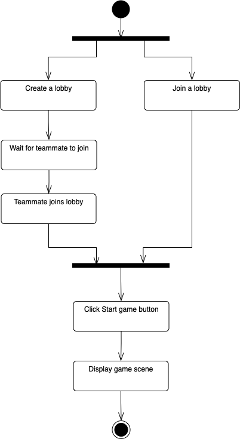

# _Technical design_

_Group 1 : GameChangers – DHI2V.So_ - Project Server and Client

---

## 1 Game Engines Researched and Discussed

For this project's scope, all the team members decided to focus on the JavaScript game engines since every member had experienced JavaScript before, and it would be the best option to have all people on the same page.

During the class, we talked about 3 different game engines: Phaser, KiwiJs, and PixiJS. Each section below will briefly describe how those game engines are working.

### 1.1 Phaser

According to the README.md file on Phaser's [GitHub repository](https://github.com/photonstorm/phaser/blob/master/README.md): "Phaser is a fast, free, and fun open source HTML5 game framework that offers WebGL and Canvas rendering across desktop and mobile web browsers. Games can be compiled to iOS, Android and native apps by using 3rd party tools. You can use JavaScript or TypeScript for development". For more information, please refer to the [website](https://phaser.io/) or [API Documentation.](https://newdocs.phaser.io/docs/3.55.2)

### 1.2 KiwiJS

According to the README.md file on KiwiJS's [GitHub repository](https://github.com/gamelab/kiwi.js#readme): "Kiwi.js is the world's easiest to use Open Source HTML5 game framework for making both mobile and desktop HTML5 browser games.". KiwiJS uses [CocoonJS](https://ludei.com/) framework for publishing games and App creation. For further information, please refer to the website or API Documentation.

### 1.3 PixiJS

According to the README.md file on PixiJS's [GitHub repository](https://github.com/pixijs/pixijs#readme): "PixiJS is a rendering library that will allow you to create rich, interactive graphics, cross platform applications, and games without having to dive into the WebGL API or deal with browser and device compatibility.". For more details about the library, refer to the [website](https://pixijs.com/) or the [API Documentation](https://pixijs.download/release/docs/index.html)

After researching those options, we come up with the advantages and disadvantages of each option in the table below:

| | Advantages | Disadvantages |
|-|------------|---------------|
| KiwiJS | - Easy to learn   - On boarding process is straightforward => grasp understanding about game development principles | - Project is abandoned (latest commit on 15 November 2015)   - Community is not active, probably less support. |
| PixiJS | - Great to create interactive graphics and animations   - Many resources available => better learning experience   - Hundreds of global brands are using PixiJS | - Hard to know how to modularize as a beginner who never used PixiJS before   - Not very compatible with ReactJS   - The available documentation is good for implementing functionality but not ideal for setting up and identifying bugs   - Boilerplate is outdated |
| Phaser | - Well suited to create 2D games that can be played right in the browser   - Simple to learn and utilize to build a game   - Relatively easy to learn how to modularize   - Documentation is helpful | - Not ideal for creating interactive graphics and animations   - Need to have 2D sprites (recommend 32x32 for canvas and 64x64 for pixels) |

## 2 Game Engine Chosen

The game engine chosen for this project is **Phaser**, used to create 2D games for the browser. Our main concerns when selecting an engine were the following:

- Should support the JavaScript language since all the team members are familiar with it, and learning a new language just for this project would be time-consuming.
- There must be resources and documentation to create a multiplayer game.
- 2D game support
- Should run in the browser.

**Phaser** is the best choice for our needs. It is free and open-source with support for 2D games. There are thousands of games made with it, and there are many learning resources for us to turn our design into a reality. The documentation is extensive and detailed. There are a lot of features supported by the engine which will speed up development, like animations, physics, particles, and sound effects.

Phaser is a JavaScript framework that can be imported and provides valuable tools for making browser games. There is no built-in multiplayer support, but it can be added by using the socket.io library. We plan to use node.js on the backend to create the server to which the players will connect. All communication will go through the node server.

It uses HTML5 and Canvas or WebGL to render the game in the browser. This allows excellent performance across all platforms, and it is also possible to port a game for mobile devices.

## 3 Technology Stack

### 3.1 Backend

Node.js was decided to be used for the development of the backend. We came to this decision for several reasons. Firstly, using JavaScript for server-side application development has become increasingly popular nowadays. Therefore, it becomes increasingly easy to receive support from the development community for our development process. Secondly, we are developing a web-based game, and we will use a JavaScript engine. Therefore, it increases compatibility and reduces the problems that might occur by developing a server-side application in JavaScript using Node.js. In addition, all team members agreed that Node.js is the tool that we are currently most familiar and comfortable with, and we had enough experience to use it for the development of the backend confidently.

### 3.2 Database

PostgreSQL was chosen for persisting data. A discussion on whether we should use relational or non-relational databases during our meeting eventually led us to conclude that using relational databases can benefit us. All team members are well trained for relational databases during one of the courses we had previously; therefore, the team decided that it is the most comfortable to work with a relational database. It was also pointed out that relational databases can easily help us avoid the problems caused by data duplication.

Having decided that relational databases will be used for persisting data, the team concluded that PostgreSQL would be the database management system that we use for the project. PostgreSQL is the one most team members are experienced in and comfortable with. It was decided that using tools that the team is experienced in can significantly speed up the development progress and help avoid problems.

### 3.3 Communication (frontend-backend)

We chose to go with Socket.io to connect the frontend and backend applications. This socket library was selected for its simple API to establish a connection and signal events between two systems using it. Additionally, it was chosen for its ease of implementation in browser Javascript. Socket.io can download the library binary from either a server using Socket.io or the official developers' host when running in a browser, which saves time working out a way to distribute the library or create our own. Finally, the library choice was informed by our prior experience with sockets in another project.

To transmit game state data, we defined a set of JSON structures that encode the necessary data for sending via Socket.io. These definitions can be found in the Game State Protocol file within this documentation package.

## 4 Dependencies

### 4.1 Production dependencies

We take advantage of several packages in our server to deliver certain critical functionality.

#### **dotenv**

The dotenv package provides an easy way to set global configuration variables. It was chosen for its ease of implementation and lack of additional dependencies. Currently, it is used to select the server port and maximum room size.

#### **express**

Express is used to provide web server functionality necessary for both `socket.io` and the debug webpage used for development. It was chosen out of our familiarity with the library and based on a recommendation by the `socket.io` developers.

#### **Nano ID**

The `nanoid` package was chosen to provide random identifiers for game room codes for its speed and size and a lack of external dependencies. In addition, we use a reduced character set to make it easier to remember and type the code in this project.

#### **priority-queue**

`priority-queue` is used by the server to sort/rank all completed games by their score. It was chosen for its ease of implementation into a data structure.

### 4.2 Development dependencies

During development, we use several packages to help us quickly test both the frontend and backend applications.

#### **Parcel**

For frontend development, we use the Parcel web bundler. It offers a comprehensive set of development and deployment features, like hot-reloading and error diagnostics, and compatibility with Phaser.

#### **Nodemon**

For backend development, we use the Nodemon package to offer us a similar set of development features to Parcel when running a Node.js application.

## 4 Git Flow

For managing our workflow, we are going to use git lab. The reason is that GitLab is **a web-based Git repository** that provides free open and private repositories, issue-following capabilities, and wikis.

For information on our conduct when working with the GIT repository, see the **GIT conduct** chapter in the **Code of conduct** document.

## 5 Class Diagrams
### 5.2 Class diagram (frontend)

### 5.3 Class diagram (backend)

## 6 Game Flow
#### 6.1 Proccesses

A lobby has to be created to start playing the game, and a second player has to join afterward. If a player does not have a room designed by a friend before, he must create a new lobby. Then, the generated room code will be displayed to the player, to which the second player must connect. Next, the second participant must receive this code using an external communication method. Afterward, they can choose the "Join room" option to enter the room code and a username. After all of these are completed, the second player gets in the room with the one who created it. The only left step is to start a game by pressing a corresponding button.

#### 6.2 Scenes

There are several scenes the game goes through to display the previously mentioned menus. The first scene is LoadScene, and a player sees it only for a few seconds while the game is loading. The next scene is MenuScene, where a player has several options. When creating a lobby, the player is directed to the MenuLobbyScene. For joining a lobby, the player is sent to the MenuJoinScene, and after entering the required info, the MenuLobbyScene.

### 6.3. Create Lobby

### 6.4. Join Lobby

### 6.5. Start Game

### 6.6. Show ranking

### 6.7. Spectate

## 7 Deployment diagram

## 8 Sequence diagram

### 8.1 Collect gems

This sequence diagram shows how the system responses to the player's collect gems action. When the player overlaps the gem tile, the _Game_ object emits a 'collectGem' event to the server. Then the server delegates a handler from the _gameManager_ to listen to the emitted event. The handler updates the room's gem count and responses back to the player with the event 'gemCollected'. After receiving the response, the _Game_ displays the gem count to the player and removes the gem tile from the map.

### 8.2 Collide enemy

This sequence diagram demonstrates the system reaction to the player colliding with an enemy. When the player overlaps the enemy tile, the _Game_ object emits a 'collideEnemy' event to the server. Then the server delegates a handler from the _gameManager_ to listen to the emitted event. The handler updates the health bar of the room. If the health bar reaches 0, the room is destroyed and the server responses back to the player with the event 'gameOver'. The _Game_ handles the event and sends the player to the game over scene. In contradiction, if the health bar is not 0, _gameManager_ will reduce the health bar and response with the 'reduce health' event. Finally the _Game_ displays the health reduction to the player and also causes the player to be pushed back.

### 8.3 Chat room

This sequence diagram explains the system response to the player sending a message to the chat room. When the player/spectator sends a message to the chat room, the _ChatScene_ will emit 'chatMessage' event to the server with the message from the client as a payload. Then the server delegates a handler from the _chatManager_ to listen to the emitted event. The handler after receives the message, will broadcast the message to the room with the event 'chatMessage'. Depends on the type of client, the message will displayed to either the player room or the spectator room.

### 8.4 Step on spike trap

This sequence diagram shows the system response to the player stepping on a spike trap. When the player overlaps the spike trap tile, the _Game_ object triggers the function 'steppedOnSpikeTrap' in _SpikeTrap_ instance. The _SpikeTrap_ will emit 'hitByEnemy' event if the _SpikeTrap_ instance is enabled, active and the player is vulnerable. Then the server delegates a handler from the _gameManager_ to listen to the emitted event. The handler updates the health bar of the room. If the health bar reaches 0, the room is destroyed and the server responses back to the player with the event 'gameOver'. The _Game_ handles the event and sends the player to the game over scene. In contradiction, if the health bar is not 0, _gameManager_ will reduce the health bar and response with the 'reduce health' event. Finally the _Game_ displays the health reduction to the player.

### 8.5 Step through laser 

This sequence diagram illustrates the system responses when they player steps through the laser. When the player overlaps the laser beam tile, the _Game_ object triggers the function 'steppedInLaser' in _LaserTrap_ instance. The _LaserTrap_ will emit 'hitByEnemy' event if the _LaserTrap_ instance is enabled, active and the player is vulnerable. Then the server delegates a handler from the _gameManager_ to listen to the emitted event. The handler updates the health bar of the room. If the health bar reaches 0, the room is destroyed and the server responses back to the player with the event 'gameOver'. The _Game_ handles the event and sends the player to the game over scene. In contradiction, if the health bar is not 0, _gameManager_ will reduce the health bar and response with the 'reduce health' event. Finally the _Game_ displays the health reduction to the player.

### 8.6 Choose perks

This sequence diagram explains the system response to the player choosing a perk. When the player collects all the gems the perk tile, the _Game_ object will emit the event 'reachedEnd' to the _server_. Then the server delegates a handler from the _gameManager_ to listen to the emitted event. The handler will emit back the 'choosePerks' event to the _Game_ instance. The _Game_ after receiving the event will stop the current scene and start the _PerkScene_ in the client side. 

In the choose perk scene, when the player choose a perk, the _PerkScene_ will emit 'chosenPerk' event to the server. The server handles the event and check if both players in the room have chosen a perk. If they have, the server will emit 'perkForNextGame' event to the _PerkScene_ instance. The _PerkScene_ listens to the  event and start the next map by passing the new initial game state to _Game_ instance. If there is only 1 player has chosen a perk, the server will response the 'teammatePerkChoice' event. The _PerkScene_ listens to the event and displays the chosen perk of the teammate.